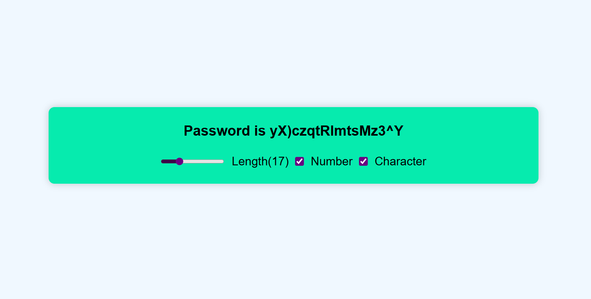

# 🔐 Password Generator (React + Responsive Design)

A responsive password generator web app built with **React**. It allows users to generate secure, random passwords with custom length and options to include numbers and special characters.

---

## 🚀 Features

✅ Random password generation  
✅ Adjustable password length using a range slider (5 to 50 characters)  
✅ Option to include numbers  
✅ Option to include special characters  
✅ Fully responsive for mobile, tablet, and desktop  
✅ Built with modern React Hooks (`useState`, `useEffect`)  
✅ Clean, center-aligned responsive UI using plain CSS  

---

## 📸 Preview

---

## 💻 Tech Stack

- React (Functional Components + Hooks)  
- CSS Flexbox for Layout  
- JavaScript ES6+  
- Responsive Design with Media Queries  

---
